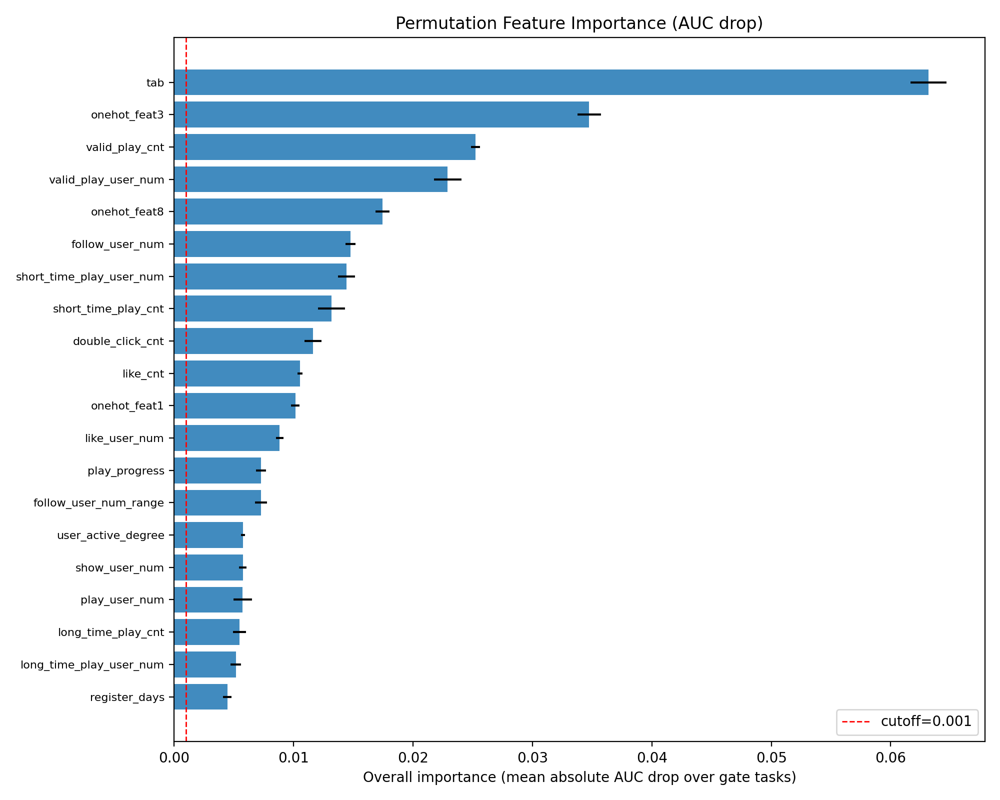
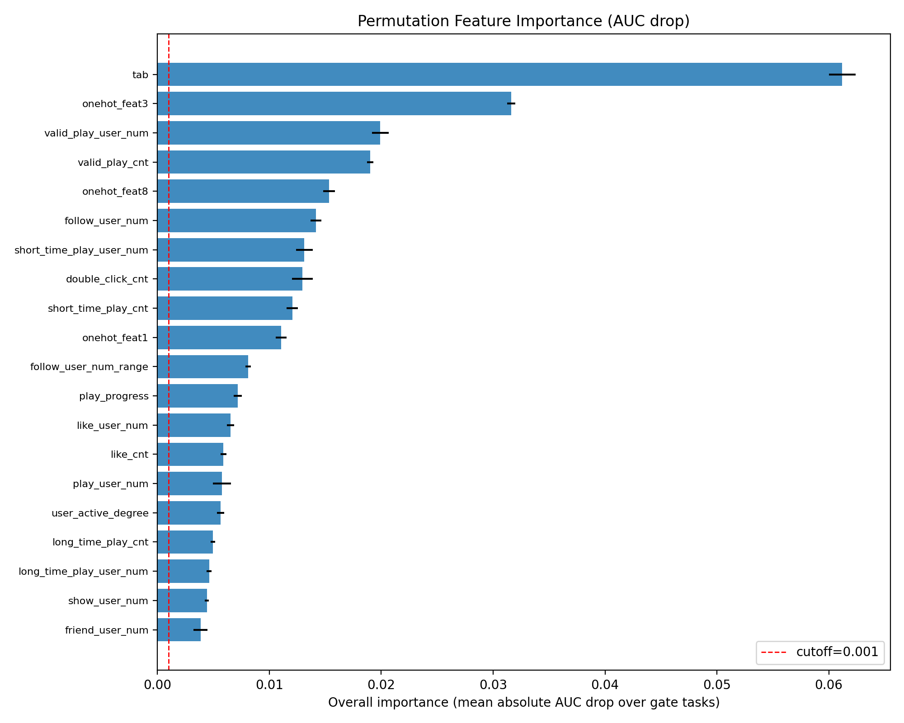

# Recommendation_KuaiRand

## KuaiRand场景中多目标CVR预测的任务特化专家优化实践

本项目基于 KuaiRand 数据集，构建用于点击、点赞、关注、评论等多任务反馈预测的推荐系统模型。当前已完成数据加载与样本拼接的基础处理流程，以及MMoE基本框架。

---

## 📁 项目结构
```
Recommendation\_KuaiRand/
├── KuaiRand-Pure/
│   ├── data/
│   │   ├── log_standard_4_08_to_4_21_pure.csv
│   │   ├── log_standard_4_22_to_5_08_pure.csv
│   │   ├── log_random_4_22_to_5_08_pure.csv   # 随机曝光日志（尚未接入）
│   │   ├── user_features_pure.csv
│   │   ├── video_features_basic_pure.csv
│   │   └── video_features_statistic_pure.csv
│   ├── data_processed/                        # 预处理产物（train/val/test + pipeline_meta.json）
│   └── saved/
│       └── runs/                              # 每次训练一个子目录
├── data_process.py                        # 数据预处理脚本
├── main.py                                # 模型训练评估
├── models/                                # 模型定义：两条正交的轴（ADR-0005）
│   ├── encoders/                          #   特征编码器：mlp（默认）/ dcn / senet
│   ├── mtl/                               #   多任务结构：mmoe（默认）/ shared_bottom / single_task / logistic
│   ├── builders.py                        #   build_model()：组装两条轴并产出 run 元数据
│   ├── registry.py                        #   名称表 + 自定义层加载入口
│   └── inputs.py                          #   共享输入分支与字段划分
├── config.py                              # 特征清单与超参数唯一配置源
├── requirements.txt                       # 锁版本依赖清单
└── README.md
```
---

## ✅ 已完成工作

- [x] 加载行为日志、用户特征、视频特征数据
- [x] 将用户和视频特征合并至行为数据，生成训练样本
- [x] 特征处理（缺失值填充、编码、归一化等）
- [x] 构建 CVR 预测模型（点击/点赞/关注/评论等）
- [x] 精排模型拆成「特征编码器 × 多任务结构」两条可插拔的轴（`mlp`/`dcn`/`senet` × `mmoe`/`shared_bottom`，ADR-0005）
- [ ] 模型评估与优化

---

## 🚀 使用说明

标准运行环境为 conda 环境 `env_tf`（Python 3.11 + TensorFlow 2.19），依赖版本见 `requirements.txt`。

1. 确保将原始数据放置在 `KuaiRand-Pure/data/` 目录下；
2. 运行数据预处理：从训练日志（4/08–4/21）中按时间切出验证集（4/16–4/21），训练集仅用于拟合编码器/标准化器，测试日志（4/22–5/08）作为最终测试集：

```bash
python data_process.py
````

3. 预处理数据结果将保存在：

```
KuaiRand-Pure/data_processed/   # processed_{X,y}[_val|_test].parquet + pipeline_meta.json
```

4. MMoE 模型训练评估（早停只看验证集，测试集仅在训练结束后评估一次）：

```
python main.py
```

每次运行都会在 `KuaiRand-Pure/saved/runs/<tag_时间戳>/` 下生成：

```
model.keras      # Keras 3 原生格式模型
metrics.json     # 种子/超参/正样本占比/逐 epoch 历史/测试集指标
curves.png       # 训练与验证 loss/AUC 曲线
training.log     # 训练日志
```

快速自检可运行 `python main.py --smoke`（每份数据最多取 2048 行、只跑 1 个 epoch）。

模型由两条独立的轴组成（ADR-0005）：特征编码器 `--encoder`（默认 `mlp`，可选 `dcn`、`senet`）与多任务结构 `--mtl`（默认 `mmoe`，可选 `shared_bottom`）。两者都会写进每个 run 的 `metrics.json`：

```bash
python main.py --encoder dcn                          # DCN-v2 编码器 + MMoE（默认结构）
python main.py --encoder senet                        # SENet 编码器（按特征域重加权）
python main.py --mtl shared_bottom --encoder mlp      # 共享底层结构
python baselines.py --models "mmoe+mlp,mmoe+dcn,mmoe+senet"   # 默认只在验证集比较
python baselines.py --models "mmoe+mlp" --final-test           # 配置锁定后的最终确认
```

`baselines.py` 的每个「配置 × seed」都会保存到汇总目录下的
`runs/<结构+编码器>/seed-<seed>/`，包含模型与独立 `metrics.json`。为保护最终确认集，
多模型比较不能使用 `--final-test`；该选项只接受一个已经锁定的模型配置和一个 seed。

---

## 📈 运行效果（Baseline v1，2026-09-07）

可复现基线的默认配置运行结果（`seed=2025`，best epoch=9，早停于 epoch 13；train 950,310 / val 190,802 / test 295,497）：

> ⚠️ 下表与「对照模型」表都是**旧默认模型**（共享输入直接进 MMoE、没有特征编码器）的结果。ADR-0005 落地后默认模型改为「特征编码器（mlp）→ 多任务结构」，这些数字不再是可复现基线，需按 ROADMAP 中的重刷任务用新默认重跑后再发布。

| 指标（测试集 4/22–5/08） | Baseline v1 |
| --- | --- |
| 总 loss | 0.6914 |
| 点击 AUC | 0.7223 |
| 点赞 AUC | 0.8090 |
| 关注 AUC | 0.7110 |
| 评论 AUC | 0.6495 |

训练与验证的 loss / AUC 曲线：


完整逐 epoch 历史与配置见 [`docs/assets/baseline_v1_metrics.json`](docs/assets/baseline_v1_metrics.json)。

---

## 📊 对照模型 v2（2026-09-16，验证集 × 3 seed）

> **合规模型选型结果。** 六个候选配置只在验证集比较，最终确认集没有加载；待配置正式锁定后，再单独进行一次最终确认。

ADR-0005 之后默认模型是「特征编码器 `mlp` → MMoE」。下表使用 seeds 2025 / 2026 / 2027、`val_auc_mean` 早停，数字为三个 seed 的验证集 mean±样本标准差（ddof=1）。

| 模型 | 点击 | 点赞 | 关注 | 评论 | 平均(4任务) | 门控均值(点击/点赞) |
| --- | --- | --- | --- | --- | --- | --- |
| logistic | 0.7189±0.0003 | 0.7895±0.0015 | 0.6885±0.0058 | 0.6236±0.0153 | 0.7051±0.0036 | 0.7542±0.0006 |
| shared_bottom+mlp | 0.7353±0.0002 | 0.8275±0.0020 | 0.6828±0.0059 | 0.6420±0.0264 | 0.7219±0.0082 | 0.7814±0.0011 |
| single_task+mlp | 0.7362±0.0006 | 0.8326±0.0031 | 0.7118±0.0124 | 0.6557±0.0100 | 0.7341±0.0054 | 0.7844±0.0016 |
| mmoe+mlp（默认） | 0.7356±0.0006 | 0.8270±0.0041 | 0.7138±0.0235 | 0.6528±0.0320 | 0.7323±0.0086 | 0.7813±0.0022 |
| mmoe+dcn | 0.7388±0.0023 | 0.8346±0.0015 | 0.6837±0.0266 | 0.6542±0.0119 | 0.7278±0.0080 | 0.7867±0.0011 |
| mmoe+senet | 0.7412±0.0009 | 0.8402±0.0042 | 0.7102±0.0220 | 0.6735±0.0093 | 0.7413±0.0072 | 0.7907±0.0020 |


观察（模型选择只依据本验证集批次）：

- `mmoe+senet` 两个汇总口径都最高：四任务均值 0.7413、门控均值 0.7907；相对默认 `mmoe+mlp` 分别提升 **+0.0090 / +0.0094**，且三个配对 seed 的差值方向一致。它是后续锁定配置与最终确认的首选候选。
- 固定 `mlp` 编码器时，Single-task 的四任务均值 0.7341、门控均值 0.7844，均高于 MMoE 和 Shared-Bottom；当前验证结果没有显示 MMoE 结构优于独立单任务模型。
- `mmoe+dcn` 的门控均值比默认 MLP 高 +0.0054，但四任务均值低 −0.0044，且整模型参数为 356,530 vs 84,652；`senet` 的整模型参数为 221,469。
- 只有 3 个 seed，因此这里用于候选排序，不把差值解释为统计显著性；最终确认集仍保持未消费。

完整结果见 [baselines_v2.md](docs/assets/baselines_v2.md) 与 [baselines_v2.json](docs/assets/baselines_v2.json)，每个 seed 的模型与 metadata 保存在 `KuaiRand-Pure/saved/runs/baseline-v2-val-3seed-20260916/`。

---

## ⚖️ 对照模型与统计特征泄漏审计（2026-09-13，旧默认模型，历史档案）

> 下列单 seed 对照也在测试集上比较了多个候选模型，且使用旧默认模型；仅供历史审计，不作为当前模型选型依据。当前有效对照以上方 2026-09-16 的验证集 v2 为准。

当时记录的结果如下：

| 模型 | 点击 | 点赞 | 关注 | 评论 | 平均(4任务) | 门控均值(点击/点赞) |
| --- | --- | --- | --- | --- | --- | --- |
| Logistic | 0.7077 | 0.7780 | 0.6672 | 0.6065 | 0.6898 | 0.7428 |
| Shared-Bottom | 0.7221 | 0.8108 | 0.6699 | 0.6172 | 0.7050 | 0.7664 |
| 单任务（每任务独立） | 0.7227 | 0.8143 | 0.6955 | 0.6420 | 0.7186 | 0.7685 |
| MMoE | 0.7225 | 0.8104 | 0.6869 | 0.6375 | 0.7143 | 0.7664 |

历史数字中 Single-task 为 0.7186、MMoE 为 0.7143、Shared-Bottom 为 0.7050、Logistic 为 0.6898；这些差值必须在验证集多 seed 重跑后才能解释。完整历史结果见 [baselines_v1.md](docs/assets/baselines_v1.md) 与 [baselines_v1.json](docs/assets/baselines_v1.json)。

**统计特征泄漏审计**：去掉全部 51 列全期视频统计特征后，四任务平均测试 AUC 从 0.7143 降到 0.6929（−0.0214），门控均值 −0.0072，评论 −0.0505、关注 −0.0210。结论是这批特征贡献可观且存在 point-in-time 风险，需按训练窗口重算后再决定保留策略，详见 [leakage_audit.md](docs/leakage_audit.md)。

```powershell
python baselines.py --models logistic,shared_bottom,single_task,mmoe --seeds 2025,2026,2027
python baselines.py --models "" --mmoe-run <已有的 MMoE run 目录> --final-test
python leakage_audit.py --seed 2025          # 训练两个变体并生成审计报告
python leakage_audit.py --skip-train         # 复用已有 run，只重写报告
```

---

## 🔬 特征优选（置换重要度）

在训练好的模型上，把单个特征取值随机打乱后重新预测，用“各任务 AUC 相对基线的下降幅度”衡量该特征的置换重要度；下降越多越重要。该模块适合定期体检现有特征，也用于将来大量新特征加入时先筛一轮再决定是否纳入模型。

```powershell
# 1.（可选）如需精确噪声对照，预处理时注入影子特征
python data_process.py --shadow-features 1

# 2. 训练模型（会读取 data_process 记录的完整特征 schema，含影子特征）
python main.py --tag fi-base

# 3. 计算置换重要度（默认在验证集上、每特征打乱 3 次）
python feature_importance.py --model KuaiRand-Pure/saved/runs/fi-base_<时间戳>/model.keras

# 快速自检 / 只分析部分特征 / 更高重复次数
python feature_importance.py --model ... --smoke
python feature_importance.py --model ... --candidate-cols shadow_0,some_new_feat
python feature_importance.py --model ... --repeats 5
```

结果写入模型目录下的 `feature_importance/`：`importance.json`（机器可读）、`importance.csv`、`importance.md`（含结论表与相关特征提示）、`importance_top.png`（Top-N 条形图）。

判定口径（详见 `docs/adr/0002` 与 `CONTEXT.md`）：

- 报告输出 4 个任务的逐任务下降（含负值，不隐式归零）；门控默认只看点击、点赞两个信号充足任务（`--tasks` 可改）；
- 判定规则：`均值 − std ≥ cutoff` 为“通过”；仅均值过线为“待确认”；否则“不通过”（默认 `--cutoff 0.001`）；
- `shadow_*` 影子特征是随机噪声，其重要度即噪声下限参考；
- 强相关数值特征（默认 `|r| ≥ 0.9`）会在报告中列出——置换重要度会在相关特征间摊薄，请合并解读，不单独按排名下结论。

### 真实结果 v2（2026-09-15，新默认模型）

用 ADR-0005 之后的新默认模型（`mmoe+mlp`，seed 2025）在**同一个特征决策集**上重跑：`fi-v2-base_20260915_090053`（验证集 190,802 行，94 特征 × 3 次置换，耗时 213 秒）。**旧默认模型得出的判定已全部作废**——模型换了，重要度数值与阈值判定都随之变化。

| 汇总项 | v2（新默认模型） | v1（旧默认模型，2026-09-10） |
| --- | --- | --- |
| 判定分布（通过 / 待确认 / 不通过） | 50 / 4 / 40 | 50 / 0 / 44 |
| 影子特征 `shadow_0` 总体重要度 | 0.000082 ± 0.000050 | 0.000095 ± 0.000062 |
| 高相关系数值特征对（\|r\| ≥ 0.9） | 93 对 | 93 对 |
| 决策集基线 AUC（点击/点赞/关注/评论） | 0.7352 / 0.8271 / 0.8108 / 0.7441 | 0.7378 / 0.8318 / 0.8275 / 0.7614 |

两个 run 的影子特征都远低于 `cutoff=0.001`，噪声下限依旧被正确识别，阈值口径无需调整。

**13 个特征的判定发生变化**（变化集中在 0.0005–0.002 的弱信号边界区）：

| 变化 | 特征 |
| --- | --- |
| 通过 → 待确认 | `onehot_feat6`、`onehot_feat11`、`onehot_feat12` |
| 通过 → 不通过 | `is_live_streamer`、`register_days_range`、`share_user_num` |
| 不通过 → 通过 | `complete_play_user_num`、`direct_comment_cnt`、`download_cnt`、`follow_cnt`、`follow_user_num1`、`reduce_similar_cnt` |
| 不通过 → 待确认 | `comment_like_user_num` |

Top 10 的头部排序基本稳定（`tab` 0.0632 仍是第一），只有第 10 位由 `onehot_feat1` 换成 `like_cnt`：

| 特征 | 总体重要度 | 点击 | 点赞 | 关注 | 评论 |
| --- | --- | --- | --- | --- | --- |
| tab | 0.06315 ± 0.00151 | +0.0940 | +0.0323 | +0.0033 | +0.0394 |
| onehot_feat3 | 0.03475 ± 0.00097 | +0.0209 | +0.0486 | +0.0062 | +0.0055 |
| valid_play_cnt | 0.02523 ± 0.00038 | +0.0401 | +0.0104 | +0.0076 | +0.0056 |
| valid_play_user_num | 0.02290 ± 0.00114 | +0.0378 | +0.0080 | +0.0080 | +0.0022 |
| onehot_feat8 | 0.01745 ± 0.00058 | +0.0108 | +0.0241 | +0.0013 | +0.0052 |
| follow_user_num | 0.01476 ± 0.00042 | +0.0031 | +0.0264 | +0.1001 | +0.0101 |
| short_time_play_user_num | 0.01442 ± 0.00070 | +0.0216 | +0.0073 | +0.0066 | +0.0150 |
| short_time_play_cnt | 0.01316 ± 0.00113 | +0.0196 | +0.0068 | +0.0045 | +0.0126 |
| double_click_cnt | 0.01162 ± 0.00072 | +0.0009 | +0.0223 | +0.0004 | +0.0062 |
| like_cnt | 0.01052 ± 0.00021 | +0.0007 | +0.0203 | +0.0053 | +0.0043 |



完整报告：[Markdown](docs/assets/feature_importance_v2_report.md) · [CSV](docs/assets/feature_importance_v2.csv) · [JSON](docs/assets/feature_importance_v2.json)

> ⚠️ 这只是 ADR-0002 两阶段门控的**批量阶段**：任何「通过」在采纳前仍需确认阶段（同种子重训对比有/无该特征），该阶段至今未实现（RANK-P2-1）。

### 真实结果 v1（2026-09-10，旧默认模型，已被上面的 v2 取代）

在带 1 个影子特征的基线上运行：`fi-shadow_20260910_010531`（验证集 190,802 行，94 特征 × 3 次置换，耗时约 4 分钟，seed=2025）。

| 汇总项 | 值 |
| --- | --- |
| 判定分布（通过 / 待确认 / 不通过） | 50 / 0 / 44 |
| 影子特征 `shadow_0` 总体重要度 | 0.000095 ± 0.000062（低于 cutoff=0.001，正确判为“不通过”） |
| 高相关数值特征对（\|r\| ≥ 0.9） | 93 对（主要为曝光/播放/点赞等计数族，需合并解读） |

Top 10 特征（总体重要度 = 门控任务平均绝对 AUC 下降；分任务列为该任务 AUC 下降均值）：

| 特征 | 总体重要度 | 点击 | 点赞 | 关注 | 评论 |
| --- | --- | --- | --- | --- | --- |
| tab | 0.06120 ± 0.00119 | +0.0926 | +0.0298 | +0.0053 | +0.0289 |
| onehot_feat3 | 0.03162 ± 0.00035 | +0.0195 | +0.0438 | +0.0052 | +0.0014 |
| valid_play_user_num | 0.01991 ± 0.00074 | +0.0356 | +0.0042 | +0.0055 | +0.0027 |
| valid_play_cnt | 0.01902 ± 0.00028 | +0.0362 | +0.0018 | +0.0044 | +0.0050 |
| onehot_feat8 | 0.01532 ± 0.00052 | +0.0082 | +0.0224 | +0.0072 | +0.0049 |
| follow_user_num | 0.01416 ± 0.00049 | +0.0021 | +0.0262 | +0.0830 | +0.0058 |
| short_time_play_user_num | 0.01312 ± 0.00075 | +0.0235 | +0.0027 | +0.0089 | +0.0071 |
| double_click_cnt | 0.01294 ± 0.00093 | +0.0021 | +0.0238 | +0.0009 | +0.0037 |
| short_time_play_cnt | 0.01204 ± 0.00051 | +0.0202 | +0.0039 | +0.0020 | +0.0049 |
| onehot_feat1 | 0.01104 ± 0.00048 | +0.0059 | +0.0162 | +0.0023 | +0.0203 |



完整报告：[Markdown](docs/assets/feature_importance_report.md) · [CSV](docs/assets/feature_importance.csv) · [JSON](docs/assets/feature_importance.json)

设计决策与术语表见 [docs/adr/0002-permutation-importance-and-two-stage-gate.md](docs/adr/0002-permutation-importance-and-two-stage-gate.md) 与 [CONTEXT.md](CONTEXT.md)。

---

## 📚 数据集引用

本项目使用的 KuaiRand 数据集来自 CIKM 2022：

```bibtex
@inproceedings{gao2022kuairand,
  title = {KuaiRand: An Unbiased Sequential Recommendation Dataset with Randomly Exposed Videos},
  author = {Gao, Chongming and Li, Shijun and Zhang, Yuan and Chen, Jiawei and Li, Biao and Lei, Wenqiang and Jiang, Peng and He, Xiangnan},
  url = {https://doi.org/10.1145/3511808.3557624},
  doi = {10.1145/3511808.3557624},
  booktitle = {Proceedings of the 31st ACM International Conference on Information and Knowledge Management},
  series = {CIKM '22},
  location = {Atlanta, GA, USA},
  numpages = {5},
  year = {2022},
  pages = {3953–3957}
}
```

---

## 📌 后续计划

完整的精排范围路线图（完整性定义、P0/P1/P2 里程碑、验收标准与 issue 清单）见 [ROADMAP.md](ROADMAP.md)，已完成实验的台账见 [docs/experiments.md](docs/experiments.md)。

* ~~模块化数据处理与建模流程~~ 已完成（里程碑 1：train/val/test 协议 + 单一配置源 + run 产物归档）
* ~~支持多反馈目标的多任务学习~~ 已完成（MMoE 四任务可复现基线）
* ~~精排模型两轴可插拔（特征编码器 × 多任务结构）~~ 已完成（ADR-0005：`mlp`/`dcn`/`senet` × `mmoe`/`shared_bottom`，含 3 seed 对照与置换重要度重跑）
* 多任务结构升级（PLE/CGC）——接口已就位，需要先做一轮设计拷问（分层专家、任务共享/独享、门控结构）
* 特征门控的确认阶段（ADR-0002 同种子重训对比，RANK-P2-1）
* 排序指标套件（GAUC / NDCG@K / Recall@K / MAP）与概率校准（ECE）
* 引入深度模型（如 Transformer）进行序列建模
* 支持线上推理与实验评估
* 稀疏任务 focal loss、随机曝光日志去偏等模型实验

---

欢迎交流与贡献 👋

```

