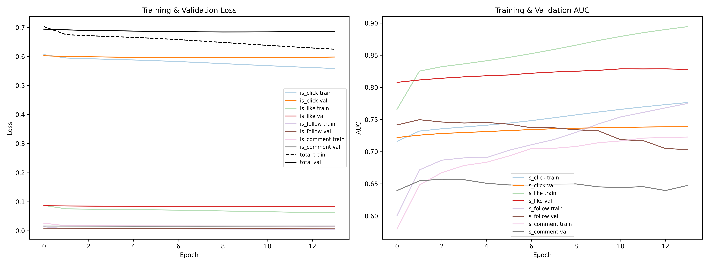

# Recommendation_KuaiRand

## KuaiRand场景中多目标CVR预测的任务特化专家优化实践

本项目基于 KuaiRand 数据集，构建用于点击、点赞、关注、评论等多任务反馈预测的推荐系统模型。当前已完成数据加载与样本拼接的基础处理流程，以及MMoE基本框架。

---

## 📁 项目结构
```
Recommendation\_KuaiRand/
├── KuaiRand-Pure/
│   ├── data/
│   │   ├── log_standard_4_08_to_4_21_pure.csv
│   │   ├── log_standard_4_22_to_5_08_pure.csv
│   │   ├── log_random_4_22_to_5_08_pure.csv   # 随机曝光日志（尚未接入）
│   │   ├── user_features_pure.csv
│   │   ├── video_features_basic_pure.csv
│   │   └── video_features_statistic_pure.csv
│   ├── data_processed/                        # 预处理产物（train/val/test + pipeline_meta.json）
│   └── saved/
│       └── runs/                              # 每次训练一个子目录
├── data_process.py                        # 数据预处理脚本
├── main.py                                # 模型训练评估
├── MMoE_model.py                          # MMoE网络模型
├── config.py                              # 特征清单与超参数唯一配置源
├── requirements.txt                       # 锁版本依赖清单
└── README.md
```
---

## ✅ 已完成工作

- [x] 加载行为日志、用户特征、视频特征数据
- [x] 将用户和视频特征合并至行为数据，生成训练样本
- [x] 特征处理（缺失值填充、编码、归一化等）
- [x] 构建 CVR 预测模型（点击/点赞/关注/评论等）
- [ ] 模型评估与优化

---

## 🚀 使用说明

标准运行环境为 conda 环境 `env_tf`（Python 3.11 + TensorFlow 2.19），依赖版本见 `requirements.txt`。

1. 确保将原始数据放置在 `KuaiRand-Pure/data/` 目录下；
2. 运行数据预处理：从训练日志（4/08–4/21）中按时间切出验证集（4/16–4/21），训练集仅用于拟合编码器/标准化器，测试日志（4/22–5/08）作为最终测试集：

```bash
python data_process.py
````

3. 预处理数据结果将保存在：

```
KuaiRand-Pure/data_processed/   # processed_{X,y}[_val|_test].parquet + pipeline_meta.json
```

4. MMoE 模型训练评估（早停只看验证集，测试集仅在训练结束后评估一次）：

```
python main.py
```

每次运行都会在 `KuaiRand-Pure/saved/runs/<tag_时间戳>/` 下生成：

```
model.keras      # Keras 3 原生格式模型
metrics.json     # 种子/超参/正样本占比/逐 epoch 历史/测试集指标
curves.png       # 训练与验证 loss/AUC 曲线
training.log     # 训练日志
```

快速自检可运行 `python main.py --smoke`（每份数据最多取 2048 行、只跑 1 个 epoch）。

---

## 📈 运行效果（Baseline v1，2026-09-07）

可复现基线的默认配置运行结果（`seed=2025`，best epoch=9，早停于 epoch 13；train 950,310 / val 190,802 / test 295,497）：

| 指标（测试集 4/22–5/08） | Baseline v1 |
| --- | --- |
| 总 loss | 0.6914 |
| 点击 AUC | 0.7223 |
| 点赞 AUC | 0.8090 |
| 关注 AUC | 0.7110 |
| 评论 AUC | 0.6495 |

训练与验证的 loss / AUC 曲线：



完整逐 epoch 历史与配置见 [`docs/assets/baseline_v1_metrics.json`](docs/assets/baseline_v1_metrics.json)。

---

## 🔬 特征优选（置换重要度）

在训练好的模型上，把单个特征取值随机打乱后重新预测，用“各任务 AUC 相对基线的下降幅度”衡量该特征的重要性；下降越多越重要。该模块适合定期体检现有特征，也用于将来大量新特征加入时先筛一轮再决定是否纳入模型。

```powershell
# 1.（可选）如需精确噪声对照，预处理时注入影子特征
python data_process.py --shadow-features 1

# 2. 训练模型（会读取 data_process 记录的完整特征 schema，含影子特征）
python main.py --tag fi-base

# 3. 计算置换重要度（默认在验证集上、每特征打乱 3 次）
python feature_importance.py --model KuaiRand-Pure/saved/runs/fi-base_<时间戳>/model.keras

# 快速自检 / 只分析部分特征 / 更高重复次数
python feature_importance.py --model ... --smoke
python feature_importance.py --model ... --candidate-cols shadow_0,some_new_feat
python feature_importance.py --model ... --repeats 5
```

结果写入模型目录下的 `feature_importance/`：`importance.json`（机器可读）、`importance.csv`、`importance.md`（含结论表与相关特征提示）、`importance_top.png`（Top-N 条形图）。

判定口径（详见 `docs/adr/0002` 与 `CONTEXT.md`）：

- 报告输出 4 个任务的逐任务下降（含负值，不隐式归零）；门控默认只看点击、点赞两个信号充足任务（`--tasks` 可改）；
- 判定规则：`均值 − std ≥ cutoff` 为“通过”；仅均值过线为“待确认”；否则“不通过”（默认 `--cutoff 0.001`）；
- `shadow_*` 影子特征是随机噪声，其重要度即噪声下限参考；
- 强相关数值特征（默认 `|r| ≥ 0.9`）会在报告中列出——置换重要度会在相关特征间摊薄，请合并解读，不单独按排名下结论。

设计决策与术语表见 [docs/adr/0002-permutation-importance-and-two-stage-gate.md](docs/adr/0002-permutation-importance-and-two-stage-gate.md) 与 [CONTEXT.md](CONTEXT.md)。

---

## 📚 数据集引用

本项目使用的 KuaiRand 数据集来自 CIKM 2022：

```bibtex
@inproceedings{gao2022kuairand,
  title = {KuaiRand: An Unbiased Sequential Recommendation Dataset with Randomly Exposed Videos},
  author = {Gao, Chongming and Li, Shijun and Zhang, Yuan and Chen, Jiawei and Li, Biao and Lei, Wenqiang and Jiang, Peng and He, Xiangnan},
  url = {https://doi.org/10.1145/3511808.3557624},
  doi = {10.1145/3511808.3557624},
  booktitle = {Proceedings of the 31st ACM International Conference on Information and Knowledge Management},
  series = {CIKM '22},
  location = {Atlanta, GA, USA},
  numpages = {5},
  year = {2022},
  pages = {3953–3957}
}
```

---

## 📌 后续计划

* ~~模块化数据处理与建模流程~~ 已完成（里程碑 1：train/val/test 协议 + 单一配置源 + run 产物归档）
* ~~支持多反馈目标的多任务学习~~ 已完成（MMoE 四任务可复现基线）
* 引入深度模型（如 Transformer）进行序列建模
* 支持线上推理与实验评估
* 多任务结构升级（PLE/CGC）、稀疏任务 focal loss、随机曝光日志去偏等模型实验

---

欢迎交流与贡献 👋

```

