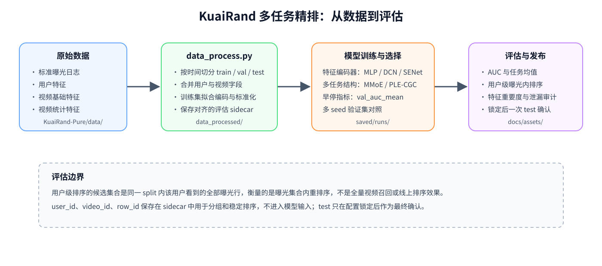
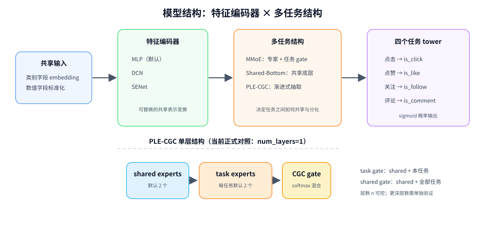
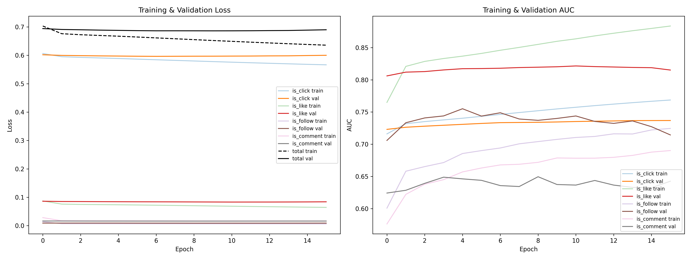
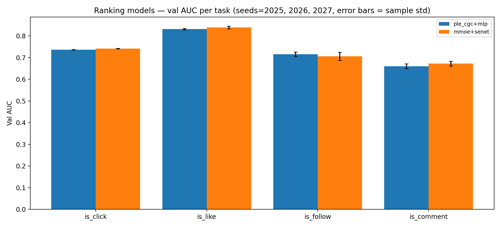
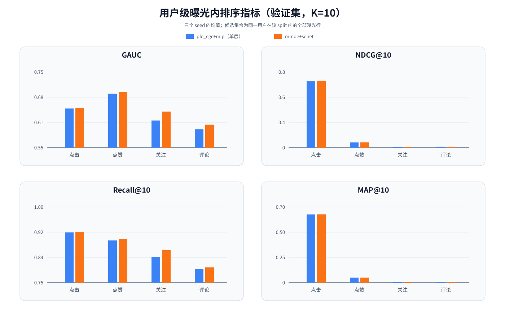

# Recommendation_KuaiRand

基于 KuaiRand 公开数据集的离线多任务推荐精排研究项目。项目把用户、视频和曝光日志拼接成样本，同时预测四类用户反馈：点击（`is_click`）、点赞（`is_like`）、关注（`is_follow`）和评论（`is_comment`）。

本仓库聚焦“给定曝光集合后的精排建模与评估”，不实现召回、粗排、全量候选生成或线上服务。历史实验记录与完整结果不堆放在本文件中，分别维护在 [`docs/experiments.md`](docs/experiments.md) 和 [`docs/project_overview.md`](docs/project_overview.md)。

## 当前状态

- 数据处理、可插拔特征编码器、多任务结构、训练产物保存和测试覆盖已经落地。
- 模型由两条正交轴组成：特征编码器（`mlp`、`dcn`、`senet`）和多任务结构（`mmoe`、`shared_bottom`、`ple_cgc`、`single_task`、`logistic`）。
- 当前合规验证集对比中，`mmoe+senet` 是候选冠军；单层 `ple_cgc+mlp`（`num_layers=1`）已完成三个 seed 的验证集对照，但尚未替换该候选。这个结论不外推到更深的 PLE 层数。
- 用户级曝光内排序评估已经提供 GAUC、NDCG@K、Recall@K、MAP@K 和 ECE，并支持以用户为重采样单位的 bootstrap 置信区间。
- 候选比较默认只读取验证集。`baselines.py --final-test` 和配置锁定后的单模型运行才应使用最终确认集（test）；test 指标不能回流到候选选择或调参。

最新实验摘要和可发布资产见：

- [`docs/experiments.md`](docs/experiments.md)：实验台账、运行目录、配置、指标和结论。
- [`docs/project_overview.md`](docs/project_overview.md)：架构、评估协议、结果解释和后续计划。
- [`docs/assets/baselines_v2.md`](docs/assets/baselines_v2.md)：六个配置 × 三个 seed 的合规验证集对照。
- [`docs/assets/ple_cgc_val_3seed.md`](docs/assets/ple_cgc_val_3seed.md)：单层 PLE-CGC 与当前候选的验证集对照。
- [`docs/assets/ranking_metrics_val_ple_mmoe.md`](docs/assets/ranking_metrics_val_ple_mmoe.md)：用户级曝光内排序评估汇总。
- [`docs/assets/training_curves_mmoe_mlp_seed2025.png`](docs/assets/training_curves_mmoe_mlp_seed2025.png)：代表性训练/验证收敛曲线。



图：从原始日志、时间切分和预处理，到模型选择、排序评估和最终确认的完整流程。

## 快速开始

### 1. 安装环境

项目按 Windows 上的 conda 环境 `env_tf` 验证，主要版本见 [`requirements.txt`](requirements.txt)。推荐使用 Python 3.11、TensorFlow 2.19 和 Keras 3.9：

```powershell
conda create -n env_tf python=3.11
conda activate env_tf
python -m pip install -r requirements.txt
```

如果已有兼容的 TensorFlow 环境，只需确认依赖版本满足 `requirements.txt`。仓库没有把生成的 `data_processed/` 和 `saved/` 训练目录作为源码依赖提交。

### 2. 准备原始数据并预处理

将 KuaiRand-Pure 的原始文件放到 `KuaiRand-Pure/data/`：

```text
log_standard_4_08_to_4_21_pure.csv
log_standard_4_22_to_5_08_pure.csv
user_features_pure.csv
video_features_basic_pure.csv
video_features_statistic_pure.csv
```

运行：

```powershell
python data_process.py
```

预处理脚本会合并曝光日志、用户特征和视频特征，按时间从训练日志中切出验证集，并只用训练子集拟合类别编码器和数值标准化器。若需要验证置换重要度的噪声下限，可以显式加入真实模型输入中的 shadow 特征：

```powershell
python data_process.py --shadow-features 1
```

### 3. 训练一个模型

默认是 `mlp` 特征编码器 + `mmoe` 多任务结构：

```powershell
python main.py --seed 2025
```

快速检查代码、数据和模型是否能完整跑通：

```powershell
python main.py --smoke
```

常用组合：

```powershell
python main.py --encoder dcn --mtl mmoe --seed 2025
python main.py --encoder senet --mtl mmoe --seed 2025
python main.py --encoder mlp --mtl shared_bottom --seed 2025
python main.py --encoder mlp --mtl ple_cgc --ple-layers 1 --seed 2025
python main.py --encoder mlp --mtl ple_cgc --ple-layers 2 --seed 2025
```

`--ple-layers n` 只在 `--mtl ple_cgc` 时生效，`n` 必须是正整数。首版正式对照采用 `n=1`，更深层数需要单独实验，不能沿用单层 PLE 的结论。

## 数据与划分

### 原始数据和时间窗口

项目使用 KuaiRand 的标准曝光日志。`log_random_4_22_to_5_08_pure.csv` 当前未接入默认处理流程；默认流程使用两个 `log_standard` 文件。

训练日志中的 `date >= 20220416` 行作为验证集，其余行作为训练集；`4/22–5/08` 的日志作为最终确认集：

| 划分 | 来源 | 用途 |
| --- | --- | --- |
| train | `4/08–4/15` | 拟合模型、类别编码器和数值标准化器 |
| val | `4/16–4/21` | 早停、模型选择、特征决策和用户级排序比较 |
| test | `4/22–5/08` | 配置锁定后的最终确认 |

当前处理产物的规模约为 train 950,310 行、val 190,802 行、test 295,497 行；实际行数以 `pipeline_meta.json` 为准。

### 处理产物

`data_process.py` 会在 `KuaiRand-Pure/data_processed/` 下生成：

```text
processed_X.parquet              # train 特征
processed_y.parquet              # train 四任务标签
processed_X_val.parquet
processed_y_val.parquet
processed_X_test.parquet
processed_y_test.parquet
processed_ids.parquet            # 评估 sidecar
processed_ids_val.parquet
processed_ids_test.parquet
pipeline_meta.json               # 行数、字段、词表规模、划分元数据
label_encoders.pkl               # 训练集拟合的类别编码器
scaler.pkl                       # 训练集拟合的数值标准化器
feature_offsets.pkl              # 类别字段的词表偏移
```

模型输入不包含 `user_id`、`video_id` 和原始日期字符串。它们与 `row_id` 保存在评估 sidecar 中，只用于用户分组、相同分数时的稳定排序和审计，不参与模型训练。

### 特征处理边界

- 类别字段使用训练集拟合的编码器，验证集和测试集的未见值映射到 `UNK`。
- 数值字段使用训练集拟合的 `StandardScaler`。
- 原始 `date` 转为星期几后进入特征；原始日期仍保留在 sidecar。
- 当前视频统计特征包含全期聚合信息，存在 point-in-time 风险。已有 [`docs/leakage_audit.md`](docs/leakage_audit.md) 记录审计证据，但严格按训练窗口重算仍是后续工作，不应把现有结果理解为泄漏已经完全解决。

## 代码结构

```text
Recommendation_KuaiRand/
├── KuaiRand-Pure/
│   ├── data/                       # 原始 CSV
│   ├── data_processed/             # 预处理 Parquet 与编码器产物
│   └── saved/runs/                 # 本地训练运行目录，不作为源码提交
├── data_process.py                 # 合并、时间切分、编码、标准化
├── data_loading.py                 # 读取 split、字段 schema 和评估 sidecar
├── config.py                       # 路径、字段清单、标签和训练默认值
├── main.py                         # 单模型训练、早停、保存和最终评估
├── baselines.py                    # 多配置、多 seed 的验证集对照
├── evaluation.py                   # 用户级曝光内排序指标
├── aggregate_ranking.py            # 多 seed 排序评估汇总
├── feature_importance.py           # 置换重要度与两阶段门控报告
├── leakage_audit.py                # 统计特征泄漏对照审计
├── models/
│   ├── inputs.py                   # 共享输入和字段布局
│   ├── builders.py                 # 组装“编码器 × 多任务结构”
│   ├── registry.py                 # 模型名称注册与 Keras 自定义层
│   ├── encoders/                   # mlp、dcn、senet
│   └── mtl/                        # mmoe、shared_bottom、ple_cgc 等
├── tests/                          # 数据、构建、训练辅助和评估测试
├── docs/                           # 架构、实验、审计、ADR 与发布资产
├── CONTEXT.md                      # 项目术语和评估边界
└── ROADMAP.md                      # 里程碑和后续任务
```

## 模型说明



图：特征编码器负责共享表示变换，多任务结构负责任务间共享与分化；PLE-CGC 的层数由 `num_layers=n` 控制。

### 两条正交轴

模型构建由 `models/builders.py` 统一完成，不同轴可以独立组合：

| 轴 | 可选项 | 作用 |
| --- | --- | --- |
| 特征编码器 | `mlp`、`dcn`、`senet` | 将拼接后的类别 embedding 和数值字段变换为共享表示 |
| 多任务结构 | `mmoe`、`shared_bottom`、`ple_cgc` | 决定四个任务如何共享或分化表示 |

`logistic` 和 `single_task` 是用于对照的基线：前者没有隐藏特征编码器，后者为每个任务训练独立模型。

### 默认 MMoE

默认链路为：

```text
共享输入 → MLP 编码器 → MMoE 专家与任务 gate → 四个任务 tower → sigmoid 输出
```

每个任务输出一个点击/点赞/关注/评论概率。训练损失使用四个二元交叉熵，任务权重在 `config.py` 中统一定义；早停默认监控 `val_auc_mean`，即点击和点赞两个门控任务的验证集 AUC 均值。

### PLE-CGC

PLE-CGC 是多任务结构，不是特征编码器。每个 progressive extraction 层包含：

- 2 个 shared experts；
- 每个任务 2 个 task-specific experts；
- expert units=48，tower units=32；
- task gate 混合 shared experts 与本任务 experts；
- shared gate 混合 shared experts 与全部 task experts。

`num_layers=n` 控制 PLE 层数，当前首版正式实验是 `n=1`。最后一层的 shared 输出不接预测头，因此 `n=1` 时最后一个 shared gate 没有下游 shared 层提供梯度；这是当前结构取舍，不是运行故障。结构决策和序列化约束见 [`docs/adr/0006-ple-cgc-multi-task-structure.md`](docs/adr/0006-ple-cgc-multi-task-structure.md)。

## 训练与模型比较

### 单模型运行

`main.py` 的主要参数：

```text
--encoder {mlp,dcn,senet}
--mtl {mmoe,shared_bottom,ple_cgc}
--ple-layers N
--seed SEED
--epochs N
--batch-size N
--patience N
--monitor {val_auc_mean,val_loss,val_output_*_auc}
--max-rows N
--drop-features col_a,col_b
--drop-stat-features
--smoke
```

每次运行写入 `KuaiRand-Pure/saved/runs/<tag>_<时间戳>/`。`main.py` 在训练完成后会评估 test 并将结果写入 `metrics.json`，因此只有在配置锁定后才应把该命令作为最终确认运行；候选比较请使用下方只读取 val 的 `baselines.py`：

```text
model.keras       # Keras 3 模型
metrics.json      # 配置、模型轴、行数、正样本率、训练历史和评估指标
curves.png        # loss/AUC 曲线
training.log      # 训练日志
```

### 合规验证集对照

模型选择推荐使用 `baselines.py`，一次运行可以重复多个配置和 seed。示例：

```powershell
python baselines.py `
  --models "logistic,shared_bottom+mlp,single_task+mlp,mmoe+mlp,mmoe+dcn,mmoe+senet" `
  --seeds 2025,2026,2027
```

PLE-CGC 对照：

```powershell
python baselines.py --models "ple_cgc+mlp" --ple-layers 1 --seeds 2025,2026,2027
```

默认报告只使用验证集，表格中的多 seed 结果是均值 ± 样本标准差。`--final-test` 只允许一个已经锁定的模型配置和一个 seed，用于最终确认；不要把 test 指标用于候选比较或调参。

当前六配置对照图（验证集、三个 seed）：


图：六个候选配置在四个任务上的验证集 AUC，误差线为三个 seed 的样本标准差。完整数值见 [`docs/assets/baselines_v2.md`](docs/assets/baselines_v2.md)。

代表性训练/验证曲线（`mmoe+mlp`、seed=2025，含 `shadow_0` 的特征重要度基准 run）：



图：同一 run 的训练/验证 loss 与四个任务 AUC 曲线，用于查看优化过程和早停前后的收敛情况。它是过程诊断图，不是多 seed 性能汇总，也不代表当前 `mmoe+senet` 冠军的单独曲线；`shadow_0` 只用于噪声基准。

单层 PLE-CGC 对照图：



图：`ple_cgc+mlp`（`num_layers=1`）与 `mmoe+senet` 的验证集 AUC 对照；该图不代表更深 PLE 层数的结果。

## 用户级曝光内排序评估

### 评估含义

`evaluation.py` 将同一 split 中同一用户看到的全部曝光行作为候选集合，在这个集合内按模型分数重新排序。它回答的是“给定曝光集合，模型能否把该用户更可能反馈的样本排到前面”，不是全量视频召回、候选覆盖率或线上排序效果。

评估 sidecar 提供 `user_id` 和 `row_id`：

- `user_id` 是分组键；
- 分数相同时用 `row_id` 做稳定排序；
- GAUC 对有正负样本的用户按曝光数加权；
- NDCG@K 和 MAP@K 对全部用户宏平均，无正样本用户记为 0；
- Recall@K 只在至少有一个正样本的用户上平均；
- GAUC、NDCG、Recall、MAP 和 ECE 都以用户为 bootstrap 单位，默认 1,000 次、95% 百分位置信区间。

### 运行单个模型

```powershell
python evaluation.py `
  --model KuaiRand-Pure/saved/runs/<run>/model.keras `
  --split val `
  --k 10 `
  --bootstrap 1000
```

结果默认写到：

```text
<run>/ranking_eval/val/ranking_metrics.json
<run>/ranking_eval/val/ranking_metrics.md
```

test 评估必须显式声明最终确认：

```powershell
python evaluation.py --model <run>/model.keras --split test --final-confirmation
```

### 汇总多个模型和 seed

当每个配置和 seed 都已经生成 `ranking_metrics.json` 后：

```powershell
python aggregate_ranking.py `
  --run-root <batch-run> `
  --models ple_cgc+mlp,mmoe+senet `
  --seeds 2025,2026,2027
```

汇总脚本只对各 seed 的点估计计算均值和样本标准差，不平均 bootstrap 区间。已发布的验证集汇总见 [`docs/assets/ranking_metrics_val_ple_mmoe.md`](docs/assets/ranking_metrics_val_ple_mmoe.md)。

当前验证集用户级排序指标对照：



图：`ple_cgc+mlp`（单层）与 `mmoe+senet` 在 GAUC、NDCG@10、Recall@10、MAP@10 上的三个 seed 均值。ECE 量纲和数值范围不同，仍以汇总表和 JSON 为准。

## 特征重要度与泄漏审计

### 置换重要度

置换重要度在固定模型和验证集上逐列打乱输入，报告各任务 AUC 相对基线的下降幅度。默认门控任务是点击和点赞；关注、评论仍会报告，但不默认参与门控排序。运行：

```powershell
python feature_importance.py --model <run>/model.keras
```

常用选项：

```powershell
python feature_importance.py --model <run>/model.keras --smoke
python feature_importance.py --model <run>/model.keras --candidate-cols tab,like_cnt
python feature_importance.py --model <run>/model.keras --repeats 5
```

报告会写入模型目录下的 `feature_importance/`，包括 JSON、CSV、Markdown 和图表。完整判定规则见 [`docs/adr/0002-permutation-importance-and-two-stage-gate.md`](docs/adr/0002-permutation-importance-and-two-stage-gate.md)。

当前默认模型的置换重要度图：


图：特征被打乱后门控任务 AUC 的平均绝对下降；红色虚线是默认门控阈值。它表示模型依赖程度，不是因果效应或业务价值排序。

### 泄漏审计

```powershell
python leakage_audit.py --seed 2025
python leakage_audit.py --skip-train
```

审计结果只能说明统计特征对离线指标的影响及其风险，不能证明因果关系，也不能替代严格按时间窗口重算视频统计特征。详细边界见 [`docs/leakage_audit.md`](docs/leakage_audit.md)。

## 输出与复现实验纪律

建议遵循以下顺序：

1. 先运行 `data_process.py`，确认 `pipeline_meta.json` 与三个 split 的行数。
2. 只用 train 拟合编码器和标准化器；候选训练和模型选择只查看 val。
3. 每个候选配置至少使用三个独立 seed，并保存配置、模型结构和运行目录。
4. 将可发布的汇总放入 `docs/assets/`，并在 [`docs/experiments.md`](docs/experiments.md) 增加一行台账。
5. 配置锁定后，才允许对 test 做一次最终确认；不要把 test 结果倒灌回模型选择。
6. 排序评估需确认模型输出、`processed_ids_<split>.parquet` 和标签按 `row_id` 严格对齐。

生成的 `KuaiRand-Pure/data_processed/`、`KuaiRand-Pure/saved/` 和临时 run 目录属于实验产物，不应代替 `docs/assets/` 中的发布汇总。

## 测试与代码检查

运行完整测试：

```powershell
python -m pytest
```

只运行排序评估测试：

```powershell
python -m pytest tests/test_evaluation.py
```

检查脚本语法和 Git 差异：

```powershell
python -m py_compile evaluation.py aggregate_ranking.py
git diff --check
```

## 已知限制

- 这是离线精排研究代码，不提供线上服务、召回系统、候选覆盖率或延迟基准。
- 用户级排序指标的候选集合仅是该 split 内用户的曝光样本；不能解读为全量视频库上的召回指标。
- 关注和评论标签稀疏，单次结果波动可能较大；推荐同时报告多 seed 的均值和样本标准差。
- 当前视频统计特征存在全期聚合带来的 point-in-time 风险，严格时间窗口重算尚未完成。
- PLE-CGC 当前只有单层正式对照；`num_layers>1` 的性能、稳定性和计算成本尚未形成结论。
- KuaiRand 的公开日志和特征文件不属于本仓库的研究产物，使用时请遵守原数据集许可证和引用要求。

## 文档索引

- [`docs/experiments.md`](docs/experiments.md)：唯一实验台账，记录有效、作废和工程验证运行。
- [`docs/project_overview.md`](docs/project_overview.md)：项目架构、模型、评估和结果详述。
- [`CONTEXT.md`](CONTEXT.md)：术语表和评估边界。
- [`ROADMAP.md`](ROADMAP.md)：里程碑、验收标准和后续工作。
- [`docs/leakage_audit.md`](docs/leakage_audit.md)：统计特征泄漏审计。
- [`docs/adr/0001-feature-decision-set-discipline.md`](docs/adr/0001-feature-decision-set-discipline.md)：特征决策集纪律。
- [`docs/adr/0002-permutation-importance-and-two-stage-gate.md`](docs/adr/0002-permutation-importance-and-two-stage-gate.md)：置换重要度与两阶段门控。
- [`docs/adr/0005-pluggable-encoder-and-multi-task-structure.md`](docs/adr/0005-pluggable-encoder-and-multi-task-structure.md)：可插拔编码器与多任务结构。
- [`docs/adr/0006-ple-cgc-multi-task-structure.md`](docs/adr/0006-ple-cgc-multi-task-structure.md)：PLE-CGC 结构约束。
- [`docs/adr/0007-user-level-ranking-evaluation.md`](docs/adr/0007-user-level-ranking-evaluation.md)：用户级曝光内排序评估协议。

## 数据集引用

```bibtex
@inproceedings{gao2022kuairand,
  title = {KuaiRand: An Unbiased Sequential Recommendation Dataset with Randomly Exposed Videos},
  author = {Gao, Chongming and Li, Shijun and Zhang, Yuan and Chen, Jiawei and Li, Biao and Lei, Wenqiang and Jiang, Peng and He, Xiangnan},
  url = {https://doi.org/10.1145/3511808.3557624},
  doi = {10.1145/3511808.3557624},
  booktitle = {Proceedings of the 31st ACM International Conference on Information and Knowledge Management},
  series = {CIKM '22},
  year = {2022},
  pages = {3953--3957}
}
```
