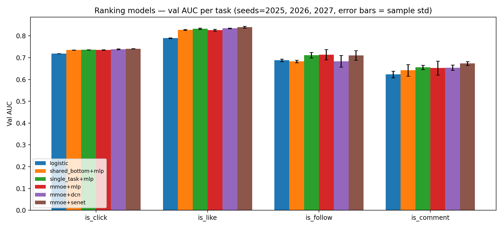

# KuaiRand 多目标 CVR 预测（MMoE）项目梳理

> 本文档基于仓库当前代码与产物整理，描述项目目标、技术方案、数据链路、实现细节与已有结果。

---

## 1. 项目概述

本项目基于 **KuaiRand**（CIKM 2022）公开数据集，构建短视频场景下的**多目标 CVR/反馈预测模型**，同时预测用户对视频的**点击（click）、点赞（like）、关注（follow）、评论（comment）**四个行为。

当前实现状态：

- 数据预处理管线已完成：原始 CSV → 样本拼接 → 特征编码/归一化 → parquet + 编码器产物；
- 已实现 **MMoE（Multi-gate Mixture-of-Experts）** 多任务模型并完成两轮训练/评估；
- 已切换到 **train/val/test 时间切分协议**：验证集（4/16–4/21）从训练日志内切出，测试集（4/22–5/08）仅在训练结束后评估一次；
- 新增单一配置源 `config.py` 与动态 `cat_vocab_size`（写于 `pipeline_meta.json`），特征清单不再三处重复；
- 每次运行的产物（`model.keras` / `metrics.json` / `curves.png` / `training.log`）统一保存到 `KuaiRand-Pure/saved/runs/<run>/`；`KuaiRand-Pure/saved/` 根目录下为旧协议历史产物。
- 新增**特征优选模块**：`feature_importance.py` 用置换重要度（AUC 下降）评估特征，支持影子特征噪声对照与报告产物；筛选纪律与术语见 `docs/adr/0001-feature-decision-set-discipline.md`、`docs/adr/0002-permutation-importance-and-two-stage-gate.md` 与 `CONTEXT.md`。

---

## 2. 技术方案

### 2.1 任务定义

| 任务 | 标签列 | 说明 |
| --- | --- | --- |
| Task1 | `is_click` | 是否点击 |
| Task2 | `is_like` | 是否点赞 |
| Task3 | `is_follow` | 是否关注 |
| Task4 | `is_comment` | 是否评论 |

每个任务均为二分类，输出层使用 sigmoid。

### 2.2 模型结构（MMoE）

```
输入
├── 35 个类别特征 (int32)
└── 58 个数值特征 (float32)

类别特征 → 共享 Embedding (vocab=2500, dim=8) → Flatten → Concat
                                                          │
数值特征 ──────────────────────────────────────────────► Concat（93 维）
                                                          │
                                                   MMoE 层
                        ┌── 8 个专家（Dense(64, ReLU)）
                        └── 每个任务一个 softmax gate
                                                          │
                        每个任务：加权专家输出 → Dense(32, ReLU) → Dense(1, sigmoid)
                                                          │
输出：is_click / is_like / is_follow / is_comment
```

自 ADR-0005 起，模型被拆成两条**正交的轴**：先过特征编码器，再进多任务结构。核心实现位于 `models/` 包：

```
models/
├── builders.py           # build_model()：组装两条轴，并产出 run 元数据
├── registry.py           # 结构/基线的名称表 + 需要 custom_objects 的自定义层
├── inputs.py             # 共享输入分支 + FeatureLayout（拼接向量的字段划分）
├── encoders/             # 特征编码器轴
│   ├── base.py           #   FeatureEncoder：稠密张量进出、声明 output_dim、配置序列化
│   ├── mlp.py            #   Dense(64, ReLU)，默认编码器
│   ├── dcn.py            #   DCN-v2：低秩交叉 2 层（rank 64）∥ 深层分支（64）
│   └── senet.py          #   按特征域 squeeze-excite（reduction 2）
└── mtl/                  # 多任务结构轴
    ├── mmoe.py           #   MMoE：8 个专家 + 每任务 softmax gate
    ├── shared_bottom.py  #   共享底层：一个主干 + 每任务塔
    ├── single_task.py    #   单任务：每任务各自一份编码器与塔
    └── logistic.py       #   逻辑回归：每个特征一个权重，按定义不接受编码器
```

两条轴的取值（两轴都可写进 `metrics.json` 的 `model` 块，可追溯到具体组合）：

| 轴 | 取值 | 说明 |
| --- | --- | --- |
| 特征编码器 `--encoder` | `mlp`（默认）、`dcn`、`senet` | 把拼接后的特征向量（35 个类别域 × 8 + 58 个数值域 = 338 维）变换成多任务结构的输入 |
| 多任务结构 `--mtl` | `mmoe`（默认）、`shared_bottom` | 决定任务之间如何共享与分化；`single_task`、`logistic` 是只在 `baselines.py` 出现的对照基线 |

编码器规格与参数量（默认 schema：35 类别 + 58 数值，无影子特征）：

| 编码器 | 形态 | 输出宽度 | 编码器参数 |
| --- | --- | --- | --- |
| `mlp` | 一层 `Dense(64, ReLU)` | 64 | 21,696 |
| `senet` | 按 93 个特征域 squeeze-excite，输出保持输入宽度 | 338 | 8,695 |
| `dcn` | DCN-v2 低秩矩阵交叉 2 层（rank 64）∥ 深层分支 `Dense(64)` | 402 | 108,900 |

- 每个编码器都是自定义 Layer：统一「稠密张量进、稠密张量出」，自带默认超参（模块级 `DEFAULTS`，可用 `encoder_overrides` 覆盖），实现 `get_config`/`build` 并注册；`models.custom_objects()` 是保存后重新加载的唯一入口。
- 低秩交叉层 `x' = x0 ⊙ (x V Uᵀ + b) + x`，`U`、`V` 各为 `dim × rank`，从不物化 `dim × dim` 矩阵，因此开销随 rank 而非输入宽度增长。
- 所有类别特征共享同一个 Embedding 层（`embed_dim=8`），数值特征直接拼接后交给编码器；`MMoE` 层为 `num_experts=8`，每任务一个 softmax gate，塔为 `Dense(32, ReLU) → Dense(1, sigmoid)`。

### 2.3 训练配置（`main.py`）

| 配置项 | 取值 |
| --- | --- |
| 优化器 | Adam |
| 损失 | 每任务 binary_crossentropy |
| 损失权重 | `is_click: 1.0`，`is_like: 1.0`，`is_follow: 0.5`，`is_comment: 0.1` |
| 评估指标 | 每任务 AUC |
| Batch size | 1024 |
| Epochs | 30（早停生效时提前结束） |
| 早停 | `monitor=val_auc_mean`（门控任务平均验证 AUC，见 ADR-0003），`patience=5`，`restore_best_weights=True` |
| 随机种子 | 2025（`main.py --seed` 覆盖；`baselines.py --seeds 2025,2026,2027` 可多值重跑并汇总 mean±std） |
| 验证集 | 训练日志尾部按时间切分（4/16–4/21，约 19.1 万行，行数见 `pipeline_meta.json`） |
| 测试集 | 仅最终评估一次（4/22–5/08，29.5 万行） |
| 运行产物 | `saved/runs/<tag>_<时间戳>/`：`model.keras` + `metrics.json` + `curves.png` + `training.log`；`metrics.json` 的 `model` 块记录两轴名称、生效超参与编码器参数量 |

损失权重体现了对标签稀疏度的先验调整：点击/点赞样本充足给满权重，关注、评论更稀疏给低权重。

---

## 3. 数据链路

### 3.1 整体流程

```
KuaiRand-Pure/data/（原始 CSV）
  log_standard_4_08_to_4_21_pure.csv   ← 训练行为日志
  log_standard_4_22_to_5_08_pure.csv   ← 测试行为日志
  user_features_pure.csv               ← 用户特征
  video_features_basic_pure.csv        ← 视频基础特征
  video_features_statistic_pure.csv    ← 视频统计特征
                    │
                    ▼  data_process.py
  ① 按 user_id / video_id 左连接拼接样本
  ② 训练日志按 date ≥ 20220416 切出验证集（train / val）
  ③ date → 星期几；缺失值统一填 -1
  ④ 35 个类别特征：仅在训练集 fit LabelEncoder + 全局偏移量 → feature_id（预留 UNK），val/test 复用并映射未见值到 UNK
  ⑤ 58 个数值特征：StandardScaler（训练集 fit，val/test 仅 transform）
  ⑥ 提取 4 个标签列；记录总 vocab 与各行数到 pipeline_meta.json
                    │
                    ▼  KuaiRand-Pure/data_processed/
  processed_X.parquet / processed_y.parquet          （训练集）
  processed_X_val.parquet / processed_y_val.parquet  （验证集）
  processed_X_test.parquet / processed_y_test.parquet（测试集）
  label_encoders.pkl / scaler.pkl / feature_offsets.pkl / pipeline_meta.json
                    │
                    ▼  main.py
  MMoE 四任务训练（seed 固定）→ 早停只盯 val → 测试集最终评估一次
                    ▼
  KuaiRand-Pure/saved/runs/<run>/（model.keras / metrics.json / curves.png / training.log）
```

### 3.2 数据规模

| 文件 | 行数（含表头） | 用途 |
| --- | --- | --- |
| `log_standard_4_08_to_4_21_pure.csv` | ≈ 114.1 万 | 训练行为日志 |
| `log_standard_4_22_to_5_08_pure.csv` | ≈ 29.5 万 | 测试行为日志 |
| `log_random_4_22_to_5_08_pure.csv` | ≈ 118.6 万 | 随机曝光日志（**尚未接入** pipeline，可用于去偏/对照实验） |
| `user_features_pure.csv` | ≈ 2.7 万 | 用户特征 |
| `video_features_basic_pure.csv` | ≈ 0.76 万 | 视频基础特征 |
| `video_features_statistic_pure.csv` | ≈ 0.76 万 | 视频统计特征 |

### 3.3 特征说明

- **类别特征（35 个）**：`date`、`hourmin`、`tab`、用户活跃度/直播/作者标记、`onehot_feat0~17`、关注/粉丝/好友/注册天数分桶、`video_type`、`upload_dt`、`upload_type`、`visible_status`、`music_type`、`tag`；
- **数值特征（58 个）**：用户粉丝/关注/注册天数，视频时长/分辨率，以及视频侧统计量（曝光、播放、点赞、评论、分享、下载、举报、收藏等计数）；
- **标签（4 个）**：`is_click`、`is_like`、`is_follow`、`is_comment`。

特征共 93 维（35 类别 + 58 数值）。

---

## 4. 目录结构

```
Recommendation_KuaiRand/
├── docs/
│   ├── project_overview.md            # 本文档
│   ├── assets/                        # 留档的运行曲线/指标（入库展示用）
│   ├── agents/                        # 工程技能消费规则（issue tracker 等）
│   └── adr/                           # 架构决策记录（特征筛选纪律等）
├── CONTEXT.md                         # 项目术语表
├── KuaiRand-Pure/
│   ├── data/                          # 原始 CSV 数据（入库）
│   ├── data_processed/                # 预处理产物（本地生成，不入库）
│   ├── saved/                         # 训练产物（本地生成，不入库；每次运行一个 runs/<run>/ 子目录）
│   └── LICENSE
├── config.py                          # 特征清单、路径与超参数唯一配置源
├── data_loading.py                    # 共享数据加载与 pipeline schema 解析
├── data_process.py                    # 数据预处理脚本
├── feature_importance.py              # 置换重要度（特征优选）模块
├── models/                            # 模型定义（输入分支 + 多任务结构按文件拆分）
├── main.py                            # 模型训练与评估
├── requirements.txt                   # 锁版本依赖（env_tf）
├── tests/                             # 单元测试（env_tf 下 unittest 运行）
├── .gitignore                         # 忽略 data_processed、saved 与生成类产物
└── README.md
```

---

## 5. 关键实现细节与注意事项

### 5.1 特征编码

- 每个类别列独立 `LabelEncoder`，编码后加上全局 `offset`，得到全局唯一的 `feature_id`，方便后续直接作为 Embedding 索引；
- 每列额外预留一个 `UNK` 类，测试集/新数据中未见过的取值会映射为 UNK；
- 数值特征使用训练集拟合的 `StandardScaler`，测试集仅做 transform，避免数据泄漏。

### 5.2 大文件与版本控制

- 生成类产物（`data_processed/` 全部内容、`saved/` 下的模型/曲线/日志）已**停止入库**并加入 `.gitignore`，仓库只保留源码、文档与原始数据 CSV；
- 完整复现请运行 `python data_process.py` 本地重新生成全部 parquet/pkl/meta（当前实现约 30 秒）；
- 说明：停止跟踪只影响后续提交；`git` 历史中已提交过的旧版本仍占用仓库体积，如需彻底瘦身需重写历史（风险高，暂不建议）。

### 5.3 已知问题 / 建议

- ~~`data_process.py` 顶部过时的 `nrows=10000` 注释~~ 已解决（脚本已重写）；
- ~~`cat_vocab_size=2500` 硬编码~~ 已解决：vocab 由编码器动态算出并写入 `pipeline_meta.json`（当前 2385），`main.py` 直接读取；
- `demo.py` 当前不存在于磁盘/未入库，无清理对象（IDE 中若仍有该标签属过期状态）；
- ~~误提交的 `__pycache__`~~ 已解决：`.gitignore` 已忽略，当前跟踪列表中无 pyc；
- ~~`.h5` legacy 保存格式~~ 已解决：新运行保存为 Keras 3 原生 `model.keras`；
- `log_random_*` 随机曝光数据尚未接入，可作为后续去偏实验的对照数据。

---

## 6. 运行方式

依赖：`tensorflow`、`pandas`、`numpy`、`scikit-learn`、`joblib`、`pyarrow`、`matplotlib`，版本锁定见 `requirements.txt`。标准环境为 conda 环境 `env_tf`（Python 3.11，CPU）。

```bash
# 0. 使用标准环境
conda activate env_tf

# 1. 数据预处理（生成 train/val/test parquet + pipeline_meta.json）
python data_process.py

# 2. 快速自检（每份数据取前 2048 行、1 个 epoch）
python main.py --smoke

# 3. 正式训练与评估（早停看 val，测试集最后评估一次）
python main.py

# 4. 模型结构轻量自检（随机输入，不需要数据文件）
python -m models
```

正式训练产物自动写入 `KuaiRand-Pure/saved/runs/<tag>_<时间戳>/`：`model.keras`、`metrics.json`（含种子、超参、正样本占比、逐 epoch history 与测试集指标）、`curves.png`、`training.log`。常用覆盖参数：`--seed`、`--epochs`、`--batch-size`、`--patience`、`--tag`、`--monitor`（默认 `val_auc_mean`，见 ADR-0003）；`--drop-features` / `--drop-stat-features` 用于特征子集对照。

---

## 7. 训练结果

### 7.1 新协议基线（可复现，2026-09-07）

运行：`baseline-v1_20260907_001737`（seed=2025，best epoch=9，早停于 epoch 13；train 950,310 / val 190,802 / test 295,497）。

| 指标（测试集 4/22–5/08） | Baseline v1 |
| --- | --- |
| 总 loss | 0.6914 |
| 点击 AUC | 0.7223 |
| 点赞 AUC | 0.8090 |
| 关注 AUC | 0.7110 |
| 评论 AUC | 0.6495 |

完整逐 epoch 历史与配置见 `docs/assets/baseline_v1_metrics.json`；训练曲线图见 `docs/assets/baseline_v1_curves.png`（已在 README 展示）。

> ⚠️ 本节与 7.4 的数字都来自**旧默认模型**（共享输入直接进 MMoE，没有特征编码器）。ADR-0005 把默认模型改成「特征编码器 → 多任务结构」之后，这些数字不再是可复现基线；新结果见 7.5。

### 7.2 旧协议历史结果（仅参考）

> ⚠️ 旧协议直接使用 4/22–5/08 测试集做早停，成绩偏乐观；下表仅作历史记录。

旧协议下两轮训练（2025-07-03）均在约第 15/16 epoch 因早停结束：

| 指标 | Run 1（215806） | Run 2（233116） |
| --- | --- | --- |
| 总 val_loss | 0.6820 | 0.6821 |
| Task1 点击 AUC | 0.7283 | 0.7290 |
| Task2 点赞 AUC | 0.8202 | 0.8232 |
| Task3 关注 AUC | 0.6651 | 0.6540 |
| Task4 评论 AUC | 0.6584 | 0.6749 |

观察：新协议下关注任务 AUC（0.7110）明显优于旧协议（0.6540–0.6651），点赞/点击略降——早停不再“看到”测试集，测试指标更可信；评论任务仍是最弱项，可作为里程碑 2 的优化重点。

### 7.3 特征优选结果（2026-09-10，旧默认模型，已被 7.6 取代）

在带 1 个影子特征的模型上（`fi-shadow_20260910_010531`，seed=2025，best epoch=9；验证集 190,802 行、94 特征 × 3 次置换、约 4 分钟）运行置换重要度：

| 汇总项 | 结果 |
| --- | --- |
| 判定分布 | 通过 50 / 待确认 0 / 不通过 44 |
| 影子特征 `shadow_0` | 0.000095 ± 0.000062（< cutoff 0.001 → 不通过，噪声对照有效） |
| 高相关特征对（\|r\|≥0.9） | 93 对（曝光/播放/点赞计数族） |

Top 5 特征：`tab`（0.0612）、`onehot_feat3`（0.0316）、`valid_play_user_num`（0.0199）、`valid_play_cnt`（0.0190）、`onehot_feat8`（0.0153）；`follow_user_num` 虽然总体排名第 6，但对关注任务单任务下降达 +0.083，是最典型的“任务特化”特征。

存档报告：`docs/assets/feature_importance_report.md`、`docs/assets/feature_importance.{json,csv}`、`docs/assets/feature_importance_top.png`（README 已展示）。

### 7.4 对照模型与统计特征泄漏审计（2026-09-13）

同一协议（seed=2025、`val_auc_mean` 早停）下的测试集对照：

| 模型 | 点击 | 点赞 | 关注 | 评论 | 四任务均值 |
| --- | --- | --- | --- | --- | --- |
| Logistic | 0.7077 | 0.7780 | 0.6672 | 0.6065 | 0.6898 |
| Shared-Bottom | 0.7221 | 0.8108 | 0.6699 | 0.6172 | 0.7050 |
| 单任务 | 0.7227 | 0.8143 | 0.6955 | 0.6420 | 0.7186 |
| MMoE | 0.7225 | 0.8104 | 0.6869 | 0.6375 | 0.7143 |

结论（门控任务早停口径）：单任务领先，MMoE 优于 Shared-Bottom 但未超过单任务，多任务结构价值待 PLE-CGC 对照。统计特征审计显示去掉 51 列全期统计特征后四任务均值下降 0.0214，point-in-time 重算列为后续必做项。结果与审计报告见 `docs/assets/baselines_v1.md`、`docs/leakage_audit.md`。

### 7.5 对照模型 v2（验证集 × 3 seed，2026-09-16）

> **合规模型选型结果。** 六个候选配置只在验证集比较，最终确认集未加载；待配置锁定后再单独进行最终确认。

ADR-0005 落地后默认模型变为「特征编码器 `mlp` → MMoE」。本节使用 seeds 2025/2026/2027、`val_auc_mean` 早停，数字为三个 seed 的验证集 mean±样本标准差（ddof=1）。

| 模型 | 点击 | 点赞 | 关注 | 评论 | 平均(4任务) | 门控均值(点击/点赞) |
| --- | --- | --- | --- | --- | --- | --- |
| logistic | 0.7189±0.0003 | 0.7895±0.0015 | 0.6885±0.0058 | 0.6236±0.0153 | 0.7051±0.0036 | 0.7542±0.0006 |
| shared_bottom+mlp | 0.7353±0.0002 | 0.8275±0.0020 | 0.6828±0.0059 | 0.6420±0.0264 | 0.7219±0.0082 | 0.7814±0.0011 |
| single_task+mlp | 0.7362±0.0006 | 0.8326±0.0031 | 0.7118±0.0124 | 0.6557±0.0100 | 0.7341±0.0054 | 0.7844±0.0016 |
| mmoe+mlp（默认） | 0.7356±0.0006 | 0.8270±0.0041 | 0.7138±0.0235 | 0.6528±0.0320 | 0.7323±0.0086 | 0.7813±0.0022 |
| mmoe+dcn | 0.7388±0.0023 | 0.8346±0.0015 | 0.6837±0.0266 | 0.6542±0.0119 | 0.7278±0.0080 | 0.7867±0.0011 |
| mmoe+senet | 0.7412±0.0009 | 0.8402±0.0042 | 0.7102±0.0220 | 0.6735±0.0093 | 0.7413±0.0072 | 0.7907±0.0020 |



模型选择观察：

- `mmoe+senet` 的四任务均值 0.7413、门控均值 0.7907 均为最高；相对默认 `mmoe+mlp` 分别为 +0.0090 / +0.0094，三个配对 seed 的差值方向一致，因此是后续锁定配置与最终确认的首选候选。
- 固定 `mlp` 编码器时，Single-task 在两个汇总口径上均高于 MMoE 和 Shared-Bottom；本批次没有显示 MMoE 结构优于独立单任务模型。
- `mmoe+dcn` 的门控均值高于默认 MLP、四任务均值低于默认 MLP，且参数更多；只有 3 个 seed，因此不把任何差值解释为统计显著性。
- v1 和历史失效 E6 都不得与本表直接比较；最终确认集仍未消费。

完整数据见 `docs/assets/baselines_v2.md`、`docs/assets/baselines_v2.json`（含每个 seed 的逐任务 AUC、best epoch 与耗时）。

### 7.6 特征优选结果 v2（新默认模型，2026-09-15）

用新默认模型（`mmoe+mlp`，seed 2025）在**同一个特征决策集**（验证集 190,802 行）上重跑置换重要度：run `fi-v2-base_20260915_090053`，94 特征 × 3 次置换，耗时 213 秒。模型一换，重要度与阈值判定都会变，因此**旧默认模型（2026-09-10）的判定全部作废**。

| 汇总项 | v2（新默认模型） | v1（旧默认模型） |
| --- | --- | --- |
| 判定分布（通过 / 待确认 / 不通过） | 50 / 4 / 40 | 50 / 0 / 44 |
| 影子特征 `shadow_0` 总体重要度 | 0.000082 ± 0.000050 | 0.000095 ± 0.000062 |
| 高相关数值特征对（\|r\| ≥ 0.9） | 93 对 | 93 对 |
| 决策集基线 AUC（点击/点赞/关注/评论） | 0.7352 / 0.8271 / 0.8108 / 0.7441 | 0.7378 / 0.8318 / 0.8275 / 0.7614 |

影子特征在两个 run 中都远低于 `cutoff=0.001`，噪声下限识别正常，阈值口径无需调整。

13 个特征的判定发生变化：`onehot_feat6`/`onehot_feat11`/`onehot_feat12` 由通过降为待确认，`is_live_streamer`/`register_days_range`/`share_user_num` 由通过降为不通过，`complete_play_user_num`/`direct_comment_cnt`/`download_cnt`/`follow_cnt`/`follow_user_num1`/`reduce_similar_cnt` 由不通过升为通过，`comment_like_user_num` 由不通过升为待确认。Top 10 头部稳定（`tab` 0.0632 仍居首），第 10 位由 `onehot_feat1` 换为 `like_cnt`。

产物：`docs/assets/feature_importance_v2_report.md`、`feature_importance_v2.{csv,json}`、`feature_importance_v2_top.png`。

> 本节只是 ADR-0002 的**批量阶段**；采纳前仍需确认阶段（同种子重训对比），该阶段尚未实现（RANK-P2-1）。

---

## 8. 后续计划与建议

精排范围的完整路线图（含 P0/P1/P2 里程碑、验收标准与 issue 清单）见仓库根目录 `ROADMAP.md`。

1. **多任务结构升级**：尝试 PLE/CGC（渐进式分层抽取）替代基础 MMoE，或按任务相关性分组专家；
2. **特征工程与优选**：加入序列特征（用户观看历史）、时间衰减、视频画像聚合特征；新特征先用置换重要度门控（批量过滤 + 同种子重训确认，见 ADR-0002），避免“全量加入”；
3. **样本不均衡**：针对关注/评论使用 focal loss、负采样或任务独立阈值；
4. **Embedding 优化**：按特征分域设置不同 vocab/dim（动态 vocab 已由 `pipeline_meta.json` 完成）；
5. **工程化**：接入 `log_random` 去偏数据、补充实验管理（wandb/mlflow）；
6. **仓库卫生**：生成类产物（`data_processed/`、`saved/`）已停止入库；如需进一步缩减仓库体积，需重写 git 历史（风险高，暂缓）。

---

## 9. 数据集引用

```bibtex
@inproceedings{gao2022kuairand,
  title = {KuaiRand: An Unbiased Sequential Recommendation Dataset with Randomly Exposed Videos},
  author = {Gao, Chongming and Li, Shijun and Zhang, Yuan and Chen, Jiawei and Li, Biao and Lei, Wenqiang and Jiang, Peng and He, Xiangnan},
  url = {https://doi.org/10.1145/3511808.3557624},
  doi = {10.1145/3511808.3557624},
  booktitle = {Proceedings of the 31st ACM International Conference on Information and Knowledge Management},
  series = {CIKM '22},
  year = {2022},
  pages = {3953--3957}
}
```
